<!-- ───────────────────────────────────────────────────────── -->

<div align="center">

`david@prod:~$ whoami`

# David

**Desenvolvedor da nova era.**<br/>
Construo produtos web com auxílio de IA. O que eu garanto é que nada vaza.

</div>

<br/>

<!-- ── assinatura: painel de auditoria ── -->
<div align="center">
  
</div>

<br/>

```log
# como eu trabalho

01  documentação e planejamento   →  modelo de negócio e lógica antes da 1ª linha
02  segurança em primeiro lugar   →  audito o diff antes de subir para produção
03  conformidade (LGPD)           →  dados pessoais pensados desde o início
04  ux que respeita o usuário     →  menor esforço possível para o resultado
05  automação                     →  software que trabalha pelo usuário
```

> A IA é minha ferramenta principal, e não escondo isso. Dá para construir sistemas
> robustos e seguros nesta era, desde que se entenda as vulnerabilidades, se estude
> os conceitos e se assuma a responsabilidade pelo que vai para produção.

```ts
const stack = {
  web:   ["Next.js", "React", "TypeScript"],
  api:   ["Node.js", "Express", "Fastify"],
  data:  ["Prisma", "PostgreSQL"],
} as const
```
